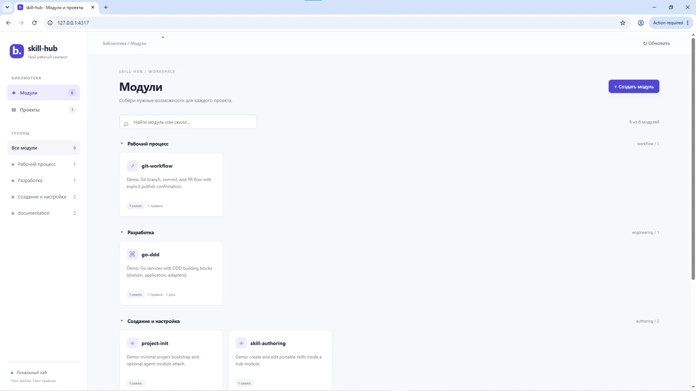
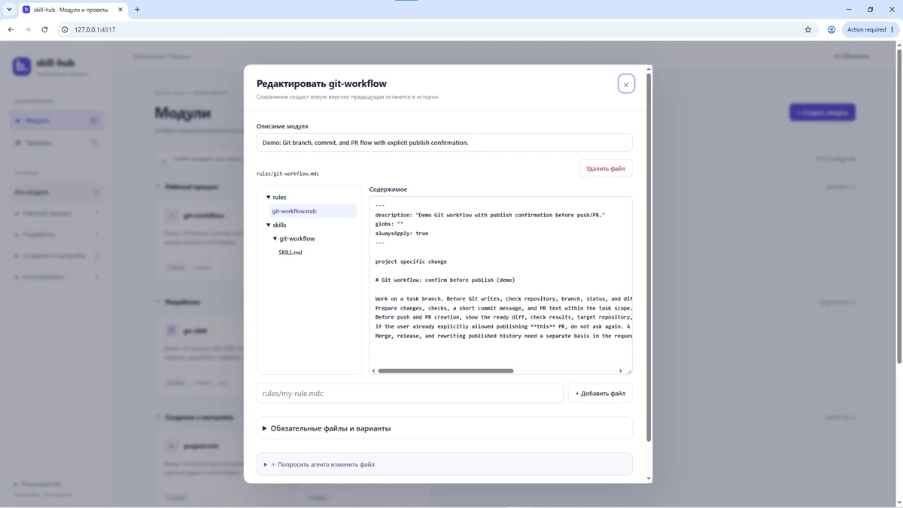
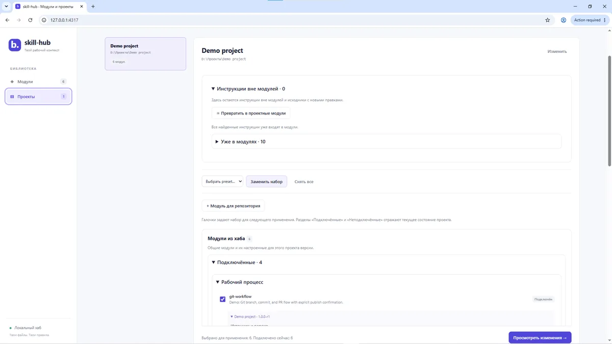

# skill-hub

Локальный менеджер контекста для AI-разработки. Хранит независимые модули из Agent Skills, Cursor Rules и переносимых ролей агентов, а затем подключает выбранный набор в конкретный проект.

GUI и установка модулей работают локально на Node.js. Cursor Agent CLI нужен только для опциональной генерации черновиков — сам Skill Hub не заменяет и не реализует CLI.

## Demo

https://github.com/user-attachments/assets/1c74a9a0-3455-4216-ac53-61fdfa782230



| Редактор модуля | Подключение модулей к проекту |
| --- | --- |
|  |  |

## Возможности

- создавать, импортировать и редактировать модули через локальный GUI;
- хранить в одном модуле skills, `.mdc`-правила и роли агентов;
- регистрировать локальные проекты и подключать к каждому свой набор модулей;
- предварительно просматривать изменения перед установкой;
- сохранять версии модулей, закреплять их в проектах и создавать проектные варианты;
- защищать локальные правки и посторонние файлы от перезаписи;
- объединять взаимоисключающие модули в `family`;
- использовать presets для типовых наборов;
- получать проверяемые черновики правок через Cursor Agent CLI.

## Как работает подключение

1. Модули хранятся в `modules/` и не действуют на сам хаб автоматически.
2. Пользователь выбирает полный итоговый набор для проекта.
3. Skill Hub строит план изменений и показывает предпросмотр.
4. После подтверждения файлы копируются в проект, а их версии и хеши записываются в lock-файл.

| Содержимое модуля | Путь в проекте |
| --- | --- |
| `skills/<name>/` | `.agents/skills/<name>/` |
| `rules/*.mdc` | `.cursor/rules/skill-hub/<module-id>/` |
| `agents/*.md` | `.agents/skill-hub/<module-id>/agents/` |
| ссылки на подключённые инструкции | управляемый блок в `AGENTS.md` |
| состояние установки | `.agents/skill-hub.lock.json` |

Повторное применение того же набора ничего не переписывает. При локальном изменении управляемого файла, конфликте путей или повреждении блока в `AGENTS.md` операция останавливается до записи.

## Демо-каталог

| Модуль | Назначение |
| --- | --- |
| `git-confirm-pr` | Git- и PR-процесс с подтверждением перед публикацией |
| `git-auto-pr` | Git- и PR-процесс без повторного подтверждения публикации |
| `go-ddd` | правила, skill и роль для Go-сервисов с DDD |
| `skill-authoring` | создание переносимых skills |
| `project-init` | минимальная инициализация проекта |

`git-confirm-pr` и `git-auto-pr` входят в одну `family: git-workflow`, поэтому одновременно можно выбрать только один вариант.

В репозитории также есть presets `minimal`, `autonomous` и `product`.

## Запуск

Требуется Node.js 18+. Установка npm-пакетов не нужна.

```bash
git clone https://github.com/egg236/skill-hub.git
cd skill-hub
node scripts/gui.mjs
```

GUI будет доступен по адресу `http://127.0.0.1:4317`. Другой порт:

```bash
node scripts/gui.mjs --port 4318
```

Системное окно выбора файлов и папок поддерживается в Windows. В других ОС абсолютный путь можно вставить вручную.

## CLI

```bash
# Показать доступные модули
node scripts/hub.mjs list

# Проверить каталог и историю версий
node scripts/hub.mjs validate

# Сначала посмотреть план
node scripts/hub.mjs apply "<project-path>" git-confirm-pr go-ddd --dry-run

# Применить тот же набор
node scripts/hub.mjs apply "<project-path>" git-confirm-pr go-ddd

# Проверить состояние проекта
node scripts/hub.mjs status "<project-path>"

# Отключить все модули
node scripts/hub.mjs apply "<project-path>" --none
```

`apply` принимает полный итоговый набор. Уже подключённый модуль, которого нет в команде, будет отключён.

Preset можно применить так:

```bash
node scripts/hub.mjs apply "<project-path>" --preset product --dry-run
```

## Формат модуля

```text
modules/<group>/<module-id>/
├── module.json
├── rules/
│   └── *.mdc
├── skills/
│   └── <skill-name>/
│       ├── SKILL.md
│       └── ...resources
└── agents/
    └── *.md
```

Минимальный `module.json`:

```json
{
  "schema": 1,
  "id": "my-module",
  "version": "1.0.0",
  "description": "What this module adds"
}
```

Для взаимоисключающих вариантов добавляется общее поле `family`. Идентификаторы модулей и skills используют `lowercase-kebab-case`.

## Cursor Agent CLI

Обычная работа GUI и CLI не зависит от Cursor Agent. Интеграция используется только в редакторе файлов по явному запросу пользователя:

1. Skill Hub запускает установленный и авторизованный `agent` во временной рабочей папке в режиме `ask`.
2. Задача и исходный текст передаются раздельно через stdin.
3. Shell, запись файлов, чтение внешнего workspace, Web и MCP запрещены локальными разрешениями задачи.
4. Ответ проверяется и показывается как черновик с diff.
5. Файл и новая версия сохраняются только после отдельного действия пользователя.

Cursor CLI не получает прямого доступа к целевому проекту и не применяет изменения самостоятельно.

## Архитектура

| Компонент | Ответственность |
| --- | --- |
| `gui/` | интерфейс без frontend-фреймворка |
| `scripts/gui.mjs` | локальный HTTP-сервер и API |
| `scripts/hub.mjs` | валидация, планирование и применение модулей |
| `scripts/gui-store.mjs` | каталог, проекты и операции GUI |
| `scripts/module-history.mjs` | версии хаба и проектные варианты |
| `scripts/agent-jobs.mjs` | изолированный запуск Cursor Agent CLI |
| `modules/` | текущие версии модулей |
| `releases/` | неизменяемые снимки опубликованных версий |
| `presets/` | именованные наборы модулей |

Стек: Node.js, vanilla HTML/CSS/JavaScript, JSON и встроенный `node:test`.

## Структура репозитория

```text
skill-hub/
├── .agents/skills/       # служебные skills самого хаба
├── gui/                  # локальный web-интерфейс
├── modules/              # редактируемый каталог модулей
├── presets/              # готовые наборы
├── releases/             # история общих версий
├── scripts/              # GUI, CLI и файловые операции
├── tests/                # тесты Node.js
└── projects.example.json # формат локального реестра проектов
```

`projects.local.json` и локальная корзина не входят в Git. Настройки, credentials и пути целевых проектов не записываются в каталог модулей.

## Проверка

```bash
node scripts/hub.mjs validate
node --test
```

## Ограничения

- приложение рассчитано на локальную работу одного пользователя;
- сервер слушает только `127.0.0.1`;
- системный выбор пути реализован только для Windows;
- генерация черновиков требует установленный и авторизованный Cursor Agent CLI;
- включённые модули являются демонстрационным каталогом, а не готовым набором для всех проектов.

## License

MIT — см. [LICENSE](LICENSE).
